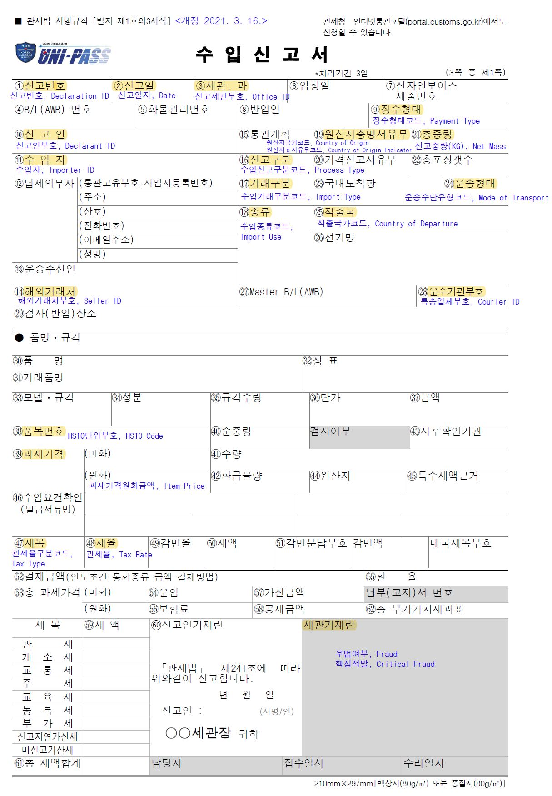

## 세관 수입신고 가상 데이터셋 [[English]](https://github.com/Seondong/Customs-Declaration-Datasets/tree/en) [[Korean]](https://github.com/Seondong/Customs-Declaration-Datasets/tree/main)

관세 행정 분야의 도메인 지식을 확산시키고, 우범 화물 선별, 품목 분류 및 관계성 예측 등 관세 분야의 연구 저변을 넓히기 위한 취지로, 가상화된 일반통관 수입신고서 데이터셋을 제작 및 배포한다. 적대적 생성 신경망을 이용해 만들어진 데이터셋은 54,000건으로 21개의 속성을 가진 [수입 신고서](./resources/수입신고서.pdf) 형태로 이루어져 있으며, 속성값의 분포, 관계성 측면에서 실 데이터셋과 상당히 유사하다. 데이터를 구축하는 과정에서 원 데이터에 존재하는 속성 간의 의존성 및 경향성을 유지하기 위하여 활용한 방법 등 자세한 내용은 논문: [가상화된 관세청 수입신고 데이터셋 소개](./resources/paper_ko.pdf)에 소개되어 있다.

### 데이터 구성
[전체 데이터](./data/df_syn.csv)는 2020년 1월부터 2021년 6월까지, 총 18개월에 걸쳐 수집된 54,000건의 가상 수입 신고 건으로, 각 건은 물품의 수입 신고 내용을 모사한다. 수입신고서에 기재하는 62가지의 속성 중 업무적으로 가장 중요한 19개의 속성과 물품의 우범 여부를 나타내는 2개의 라벨을 포함하고 있다. 각 행은 신고 일자별로 정렬되어있으며, 각 속성의 의미는 다음과 같다. 

| 속성               | 설명                                              |
| ------------------ | ------------------------------------------------- |
| 신고일자           | 신고서가 제출된 날짜                              |
| 신고세관부호       | 신고한 세관의 부호                                |
| 수입신고구분코드   | 일반 및 간이 신고 등 수입 신고의 종류에 대한 부호 |
| 수입거래구분코드   | 수입 거래의 종류 부호                             |
| 수입종류코드       | 내수용, 수출용원자재 등 수입 용도에 관한 부호     |
| 징수형태코드       | 징수의 종류에 따른 부호                           |
| 운송수단유형코드   | 운송수단 및 운송용기에 대한 부호                  |
| 신고인부호         | 신고인 상호와 성명에 따른 부호                    |
| 수입자             | 수입자의 통관고유부호                             |
| 해외거래처부호     | 해외거래처의 상호 부호                            |
| 특송업체부호       | 특송 방법 및 특송 업체의 부호                     |
| HS10단위부호       | 10자리 물품 분류 부호                             |
| 적출국가코드       | 신고물품의 해외선적국가 부호                      |
| 원산지국가코드     | 원산지 국가의 부호                                |
| 관세율             | 해당 품목의 세율(%)                               |
| 관세율구분코드     | 해당 품목의 세율에 따른 구분 부호                 |
| 원산지표시유무코드 | 원산지 표시 유무 및 표시면제사유에 따른 부호      |
| 신고중량           | 포장용기를 제외한 물품 중량(KG)                   |
| 과세가격원화금액   | 구매자가 실제로 지급한 금액(원)                   |
| 우범여부           | 우범 화물 여부                                    |
| 핵심적발           | 우범 항목 중 가중치가 높은 우범 여부              |

참고 자료:
* [수입 신고 항목정의서](./resources/항목정의서.xlsx)
* [무역통계부호](./resources/무역통계부호.pdf) 

### 생성 방법

본 데이터셋은 적대적 생성 신경망 CTGAN(Conditional Tabular GAN)을 이용하여 생성되었으며, 실제 세관 수입 신고 데이터셋과 유사한 분포를 가진다. 데이터 제작을 위하여 관세청에 최근 18개월간 신고된 일반 통관 수입신고건 중 검사 선별이 진행된 데이터를 활용하였으며, 데이터의 모든 개인 정보는 제외되거나 익명화되었다. 수입신고 데이터의 특성상 속성 간 관계성이 존재하며, 가상화를 하는 과정에서도 관계성이 유지될 수 있게 처리하였다. 

[데이터 생성 과정을 담은 코드](./codes/CTGAN을_활용한_데이터_생성.ipynb) 

### 활용 방안

본 데이터에 존재하는 우범여부/핵심적발을 타겟 변수로 하여 통관 시스템의 효율화를 위한 우범 선별 문제를 접근할 수 있다. 우범선별 알고리즘 개발 및 데이터를 활용하는 방법은 [논문](./resources/paper_ko.pdf)의 4장에서 확인할 수 있다. 이외에도 HS6단위를 부호를 예측하는 품목 분류 문제나 코드별 무역 패턴 분석, 수입자-신고인-거래처 간의 상관관계분석 등 다양한 관세 행정 문제에 벤치마크 데이터로 활용될 수 있을 거라 기대한다. 

편의를 위해 첫 12개월 분의 데이터를 [학습 데이터](./data/df_syn_train.csv)로, 다음 3개월 분의 데이터를 [검증 데이터](./data/df_syn_valid.csv)로, 마지막 3개월 분의 데이터를 성능 평가를 위한  [테스트 데이터](./data/df_syn_test.csv)로 활용할 수 있게 분리해 두었다. 본 데이터를 활용한 우범 선별 알고리즘은 [여기서](./codes/우범선별/) 확인할 수 있다. 

### Contact

데이터에 관한 질문이 있으시다면 연락 부탁드립니다. 
* 카이스트 정채윤, <lily9991@kaist.ac.kr>
* 기초과학연구원 김선동, <sundong@ibs.re.kr> 
* 관세청 박재우, <jaeus@korea.kr>
